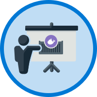
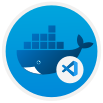
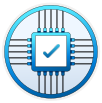
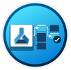
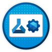
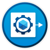

# Ömer Cem Tabar 👋
**Full Stack Software Engineer | Backend & DevOps Focused**

🇮🇹 IT (B1) • 🇬🇧 EN (Fluent) • 🇹🇷 TR (Native) 📍 Padova, Italy

Backend-first engineer with a high-performance Frontend edge. I build scalable APIs and production-ready infrastructures while maintaining a strong eye for UI/UX integrity and complex frontend architectures.

---

## 🇮🇹 Profilo (IT)
Sviluppo architetture Full Stack con un forte orientamento al Backend e DevOps.
Realizzo API robuste, ottimizzo database e gestisco infrastrutture CI/CD (Docker, K8s, Terraform). Nonostante il mio focus sistemistico, possiedo competenze avanzate nel Frontend (React/Next.js), che mi permettono di curare l'intero ciclo di vita del prodotto, garantendo performance e design di alto livello.

**Core Stack:** Ruby on Rails • Node.js • Python (FastAPI/Flask) • React • DevOps (IaC)

---

## 🇬🇧 About (EN)
Full Stack Engineer specializing in Backend systems and Cloud Infrastructure, but with a deep expertise in Frontend engineering.
I don't just "step into" Frontend; I build complex, responsive, and state-heavy web applications that connect seamlessly with the high-concurrency APIs I design. Comfortable managing the entire pipeline, from Terraform scripts to React hooks.

**Expertise:** API Design • SQL Optimization • CI/CD & Cloud Native • Advanced Frontend Logic

---

## What I Bring to the Team
- **Robust Backend Foundations:** REST/GraphQL APIs, Background Processing, and Service-Oriented Architecture.
- **Advanced Frontend Engineering:** Building complex dashboards (like Recruit HQ) with refined UI/UX and efficient state management.
- **Infrastructure as Code (IaC):** Automating deployments with Docker, Kubernetes, and Terraform to ensure 99.9% uptime.
- **Quality Assurance:** TDD/BDD approach with comprehensive Unit and Integration testing across the stack.
- **Agile Leadership:** Peer code reviews, system design, and technical mentorship.

---
## 📌 Featured Projects

<table border="0">
  <tr>
    <td width="50%" valign="top">
      <h3>🌟 Lumina</h3>
      
An AI-powered Active Capture system for high-fidelity 3D Head Avatars. Uses real-time pose guidance and 3D Gaussian Splatting to transform standard webcam feeds into animatable digital twins.

      <a href="https://github.com/oemercemtabar/Lumina"><b>View Project →</b></a>
    </td>
    <td width="50%" valign="top">
      <h3>🔍 GhostPixel-AI</h3>
      
A deep learning approach to detecting adaptive steganography in JPEG images using the ALASKA2 dataset. Built with PyTorch.

      <a href="https://github.com/oemercemtabar/GhostPixel-AI"><b>View Project →</b></a>
    </td>
  </tr>
  <tr>
    <td width="50%" valign="top">
      <h3>💼 RecruitHQ</h3>
      
Full-stack recruitment portal featuring automated candidate pipelines, job management, and real-time tracking.

      <a href="https://github.com/oemercemtabar/RecruitHQ"><b>View Project →</b></a>
    </td>
    <td width="50%" valign="top">
      <h3>🛡️ guardian-fraud-detector</h3>
      
Financial fraud detection engine utilizing machine learning [XGBoost/RandomForest/LSTM] to identify suspicious patterns in transaction data. Built with Python and Scikit-Learn.

      <a href="https://github.com/oemercemtabar/guardian-fraud-detector"><b>View Project →</b></a>
    </td>
  </tr>
  <tr>
    <td width="50%" valign="top">
      <h3>🚚 smart-logistics-lastmile-optimizer</h3>
      
A smart logistics toolkit for last-mile delivery optimization. Features include real-time route planning, multi-stop delivery sequencing, and load balancing to ensure faster delivery times.

      <a href="https://github.com/oemercemtabar/smart-logistics-lastmile-optimizer"><b>View Project →</b></a>
    </td>
    <td width="50%" valign="top">
      <h3>📡 iot-monitoring-fastapi</h3>
      
An asynchronous IoT monitoring backend built with FastAPI. Designed to ingest, process, and serve real-time sensor data through high-performance RESTful endpoints, leveraging Python's asyncio.

      <a href="https://github.com/oemercemtabar/iot-monitoring-fastapi"><b>View Project →</b></a>
    </td>
  </tr>
</table>
---

## 🧰 Tech Stack

### Backend (focus)

  

### DevOps & Observability

  

### Frontend

  

### Databases & Caching

  

### Collaboration

  

---

## Certifications & Credentials

  
  
  
  
  
  
  
  
  
  
  

  

